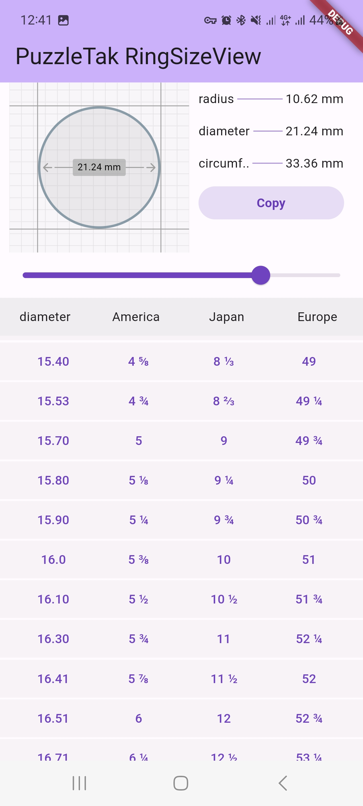

# Ring Size View

A Flutter package that provides a custom widget for calculating and displaying ring sizes.

# Demo




## Installation

To use this package, add `ring_size_view` as a dependency in your `pubspec.yaml` file.

```yaml
dependencies:
  flutter:
    sdk: flutter
  ring_size_view: ^1.0.0 # Use the latest version from pub.dev
  ````

Usage

````import 'package:ring_size_view/ring_size_view.dart';````


## RingSizeView Widget

The `RingSizeView` widget is a custom Flutter widget provided by the `ring_size_view` package. It is designed to calculate and display the size information of a ring based on the user's input.

### Properties

- `ringSize`: A double value representing the current ring size. This value is used to calculate the diameter, circumference, and radius of the ring. You can bind this value to a slider or any other input widget to allow the user to adjust the ring size.

- `calculateDiameter(value)`: A callback function that is called when the ring size is adjusted by the user. It receives the calculated diameter value as an argument. You can use this function to update the diameter value in your app.

- `calculateRadius(value)`: A callback function that is called when the ring size is adjusted. It receives the calculated radius value as an argument. You can use this function to perform any additional actions based on the radius value.

- `calculateCircumference(value)`: A callback function that is called when the ring size is adjusted. It receives the calculated circumference value as an argument. You can use this function to update the circumference value in your app.

- `height`: A double value representing the height of the `RingSizeView` widget.

- `width`: A double value representing the width of the `RingSizeView` widget.

### Example Usage

```dart
RingSizeView(
ringSize: ringSize,
calculateDiameter: calculateDiameter,
calculateRadius: calculateRadius,
calculateCircumference: calculateCircumference,
height: 190,
width: 190,
)
````


## Calculation Functions

The `calculateCircumference`, `calculateRadius`, and `calculateDiameter` functions are used in the `RingSizeView` widget to perform calculations and update the corresponding values.

### `calculateCircumference(value)`

This function is called when the user interacts with the `RingSizeView` widget and updates the value of `circumference`. It takes the calculated circumference value as an argument and updates the `circumference` variable. For example:

```dart
calculateCircumference(double value) {
  circumference = value;
  print("Info calculateCircumference : $value");
}
````


Features

    Calculate ring diameter, circumference, and radius.
    Slider to adjust the ring size.
    Customizable styles.

Getting Started

For more details and examples, check out the documentation.
Contributing

Contributions are welcome! Please fork the repository and submit a pull request.
License

This project is licensed under the Apache License 2.0 - see the LICENSE file for details.